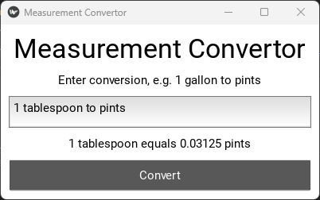

## Example of the use of the `Interpreter Pattern` in Python

This is an example of the use of the `Interpreter Pattern` in Python. The `Interpreter Pattern` is a behavioral design pattern that defines a grammar for a language and an interpreter to interpret the grammar. The grammar is defined using a class hierarchy and the interpreter is implemented using `OOP`.

The final product a simple Measurement converter ( A kivy GUI Desktop App ) that can convert between different basic measurements such as **pints**, **tablespoons**, **gallons**, **quarts** and **cups**.



## How to run the code

1. Clone the repository
2. Install the dependencies in a virtual environment

```shell
git clone https://github.com/jackkweyunga/interpreter-pattern.git
cd interpreter-pattern
python -m venv venv
pip install -r requirements.txt
```

2. Run the `main.py` file

```bash
python main.py
```

## License

This project is licensed under the MIT License - see the [LICENSE.md](LICENSE.md) file for details
